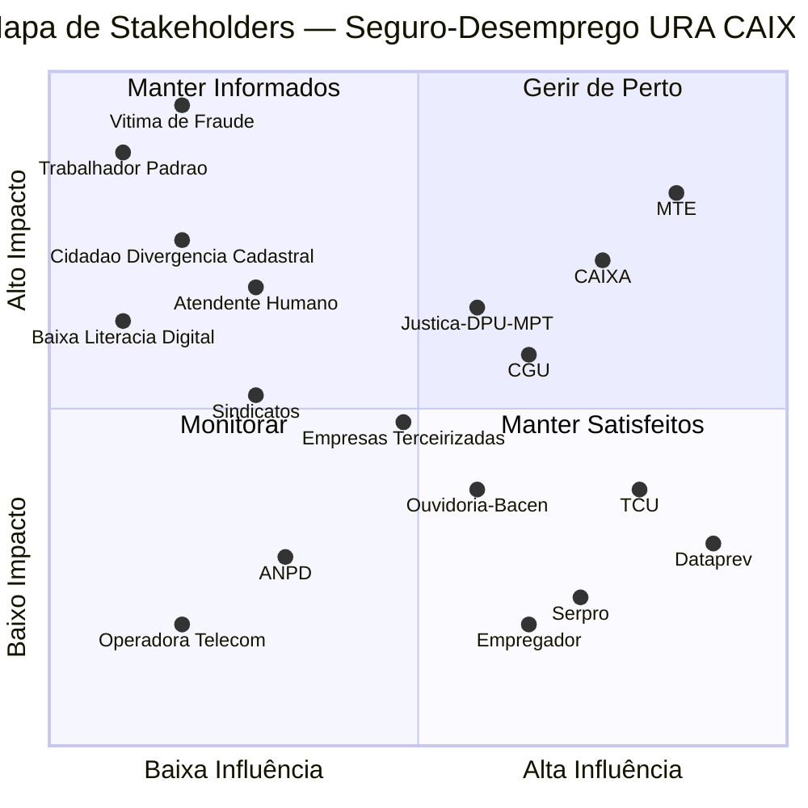

# Mapa de Stakeholders — Atendimento ao Seguro-Desemprego pela URA da CAIXA

## Diagrama Mermaid

## Tabela de Atores

| Ator | Quadrante | Influência | Impacto | Estratégia de Engajamento |
|:---|:---|:---:|:---:|:---|
| **MTE** | Gerir de Perto | Alta | Alto | Co-design das regras de elegibilidade; alinhamento contínuo sobre efeitos colaterais da política antifraude nos cidadãos legítimos |
| **CAIXA** | Gerir de Perto | Alta | Alto | Protocolo compartilhado de escalonamento com MTE/Dataprev; gestão proativa de reputação — a CAIXA paga sem decidir a elegibilidade |
| **Dataprev** | Manter Satisfeitos | Alta | Baixo | Transparência sobre taxa de falsos positivos dos algoritmos; canal de feedback sobre bloqueios indevidos para calibração da malha fina |
| **TCU** | Manter Satisfeitos | Alta | Baixo | Respostas ágeis a acórdãos; relatórios de conformidade antes de novas auditorias; auditabilidade proativa do eSocial |
| **Serpro** | Manter Satisfeitos | Alta | Baixo | Alinhamento técnico sobre qualidade e consistência dos dados ingeridos do eSocial; SLA de estabilidade na ingestão |
| **Empregador** | Manter Satisfeitos | Alta | Baixo | Comunicação clara sobre o impacto dos erros no eSocial para o trabalhador; simplificação do fluxo de correção de divergências |
| **CGU** | Zona Intermediária | Alta | Médio | Implementar recomendações de auditoria proativamente; não aguardar relatório — incorporar achados como input de melhoria contínua |
| **Justiça / DPU / MPT** | Zona Intermediária | Média | Médio-Alto | Reduzir judicialização fortalecendo resolução administrativa; tratar volume de mandados como termômetro de falha sistêmica |
| **Ouvidoria / Bacen** | Zona Intermediária | Média | Médio | Usar queixas da Ouvidoria como retroalimentação sistêmica, não só como resolução pontual de casos |
| **Empresas Terceirizadas** | Zona Intermediária | Média | Médio | Reformular incentivos contratuais: qualidade e resolução, não apenas TMA; reduzir turnover via suporte emocional estruturado |
| **Sindicatos** | Zona Intermediária | Baixa-Média | Médio | Criar canal preferencial B2G para resolução em massa de bloqueios de associados; parceria em comunicação de direitos |
| **Atendente Humano** | Manter Informados | Baixa | Alto | Ampliar acesso a sistemas de consulta; protocolos de suporte emocional; métricas de qualidade além de volume de chamadas |
| **Trabalhador Recém-Desempregado** | Manter Informados | Baixa | Muito Alto | Canal de status claro e em linguagem simples; acesso 24/7; proatividade na comunicação de prazos e próximos passos |
| **Cidadão com Divergência Cadastral** | Manter Informados | Baixa | Alto | Explicação detalhada e acessível do motivo do bloqueio; orientação estruturada para resolução presencial no MTE |
| **Pessoa com Baixa Literacia Digital** | Manter Informados | Baixa | Alto | Atendimento humano como canal primário — não fallback; URA simplificada sem direcionamento forçado para canais digitais |
| **Vítima de Fraude Trabalhista** | Manter Informados | Baixa | Máximo | Protocolo prioritário com prazo definido; canal dedicado na Ouvidoria; eliminação de burocracia probatória excessiva |
| **Operadora de Telecom** | Monitorar | Baixa | Baixo | SLA de disponibilidade de links; monitoramento de latência em horários de pico de lotes financeiros |
| **ANPD** | Monitorar | Baixa | Baixo | Revisão periódica dos dados expostos no atendimento telefônico à luz da LGPD; equilíbrio entre transparência ao cidadão e sigilo dos cruzamentos antifraude |

---

*Gerado via metodologia Stakeholder Map (Influência × Impacto) a partir do artefato B_relatorio_assistente_v3.md.*
